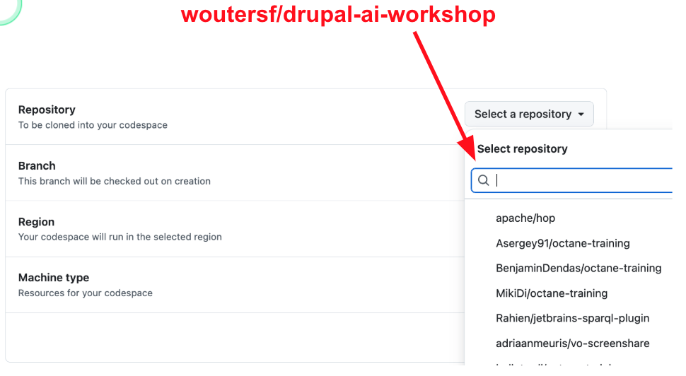
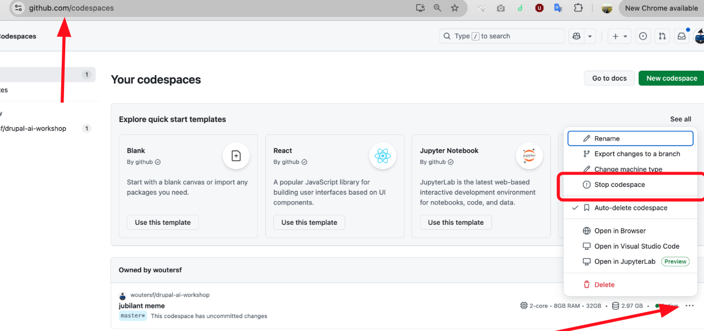

# 🤖 Drupal & AI - GETTING STARTED Workshop

## AI for editors / AI search / Automated content input

Welcome to the **Drupal & AI - GETTING STARTED Workshop**! This workshop is designed to provide you with hands-on experience integrating and leveraging Artificial Intelligence within the Drupal content management system.

### 🎯 Workshop Goal

The goal of this workshop is to get you started with practical AI implementation in Drupal, covering key areas such as enhancing the editorial experience, implementing AI-powered search (RAG), and setting up automated  AI flows.

---

### Prerequisites

To participate in this workshop, you will need:

* A **GitHub user account** (required to access the Codespace environment).
* A stable internet connection.

---

### Start Your Engines (Starting the Workspace)


1.  Navigate to **https://github.com/codespaces/new**. 
2. Start a new codespace

3.  Choose the repository **woutersf/drupal-ai-workshop**. 
4. Give it some time as it will pull the images and start the containers.



4. Open the Drupal environment by right clicking the url behind port 80 and Clicking Open in Browser


 
 Congratulations, you now have a Drupal workspace running.
 

> Don't forget to stop the workspace. Frederik's Visa card will thank you!



### Logging in to Drupal

Navigate in your browser to `/user` in the Drupal site.
Log in to the Drupal instance using the provided credentials:

| Role | Username (U) | Password (P) |
| :--- | :----------- | :----------- |
| Admin | `admin`  | `davos`  |

### Enabling the modules
Enable the following modules.
- Ai
- Ai Automator
- Ai_ckeditor
- Ai_content_suggestions
- Ai_translate
- Ai_image_alt_text
- Ai_agents
- Ai_assistant
- Litellm provider
- Postgres vdb provider

### Configuring AI Providers (The Key)

You will need to configure the AI gateway to allow the modules to communicate with large language models (LLMs).

1. Add the **Lite LLM provider key** (manage keys here: `/admin/config/system/keys`). 
2. Navigate to the configuration section for **providers** `/admin/config/ai/providers`.
3. Configure the LLM provider with the following details:
    * **AI Gateway:** `https://dev-playground.gateway.dropsolid.ai` 
    * The specific **AI API KEY** (`sk-***`) will be provided by the instructor.

### Configuring AI Defaults

Navigate to **`/admin/config/ai/settings`** to configure the core AI settings.

1.  Configure the **default AI chat model**.

2.  Configure the **default Translation model**.

3.  **Test it out:** 
	1. Navigate to the chat generation explorer `/admin/config/ai/explorers/chat_generator`
	2. Submit the question: `"Who made you?"` 


### AI for Editors

This section focuses on using AI to make the content creation and translation process more efficient.

#### 2. Automatic Image Alt Text

1.  Download a picture (e.g. from pexels.com).
2.  Configure the module at **`/admin/config/ai/ai_image_alt_text`**.

- make sure to configure a Model that has vision capabilities (like Gemini-2-5-flash)
- make sure to read the prompt so you understand what will happen.
- Configure the image style that the AI model wil look at.

3.  Create new content at `/node/add/article` and upload the image to **test the automatic alt text generation**.


Congratulations, You improved accessibility. Visually impaired visitors will now understand what't in the images you upload.

#### AI Assistant in CKEditor

1.  Go to a content type and ensure the AI Assistant is enabled in the CKEditor toolbar.
2. Configure the CKeditor Basic HTML toolbar at `/admin/config/content/formats`. 
3. Add the AI assistant into the active toolbar
4.  **Crucially:** Enable the assistant functionalities in the AI sub configuration, make sure to check the prompts.
5.  Create new content at `/node/add/article` and **test it out**.

Congratulations, you can now configure a tone of voice in the assistant config (for example always speak in spanish pirate speak). And then when editors use the generation, it will take that into account.

#### Automatic Translations

1.  Configure automatic translations at **`/admin/config/ai/ai-translate`**.
2.  Choose an AI model per language and configure the corresponding prompt.
4.  **Test it out** on the node I have provided `/node/1/translations`.

#### Smart Content Suggestions

1.  Configure Smart Content suggestions at **`/admin/config/ai/suggestions`**.
2.  Enable multiple of the available suggestions.
3.  Change the prompt for any suggestion if needed.
4.  **Test it out** on the node I have provided `/node/1/edit`.

### AI Automators

This section focuses on using AI to automate content creation and data import.

#### Exercise 1: Automatic Derived Social Media Content

**Goal:** Automatically propose social media content based on the article's body, helping marketers skip straight to the end-redaction phase.

1.  Ensure the `AI automator` module is enabled.
2.  Add a **text field** to the **Article content type** (e.g., `field_social_media_draft`).
3. Enable the AI automator Checkbox in the field configuration.
4.  Configure the automator to generate content into this field based on the article body.
	1. Automator Type: **LLM: Text**
	2. Automator Input mode: **Base Mode**
	3. Automator Base field: **Body**
	4. Automator Prompt:
````
INSTRUCTION
----------
From the context below generate a very short summary that is suitable for social media. 
Use a limited amount of emoji;s and put a newline after every sentence. 
Keep it brief and business.
It's for linkedin.

CONTEXT
-------
{{ context }}
````
5.  **See it working** by updating the existing node or saving a new Article node.


#### Exercise 2: Yoast stuff (@DB / 1X)
TODO TODOTODO TODOTODO TODOTODO TODOTODO TODO

### AI Powered Search (RAG)

This section focuses on creating a Retrieval-Augmented Generation (RAG) pipeline for intelligent search. The end result is a GPT style search.


#### RAG Setup

1.  Create a **Vector DB Key**.
2.  Set the vector provider (VDB) setting, configuring the **Postgres VDB provider**.


#### Search Indexing

1.  Create a **Search API search server**.


- Use the `Litellm Embeddings` engine
- Use the `2-5-Flash` Chat counting model
- Use the `Postgres Vector Database`
- Use Database name `DB_NAME`
- Use Collection name `frederiks_collection` But replace Frederik with your unique identifier. Like your drupal org account or something.

**Tip:** Name your collection uniquely, *unless you like chaos*.

2.  Create a **search index**.

    * Add the relevant content types to the index (double check this as the copy in the search_api screen is misleading).
    * Add the rendered_item (**Full**) to the index. And make sure you select `Main content`.


3. Take some time to create some nodes from wikipedia pages  (copy the wikiedia page content and just paste it in the ckeditor of the body field) or other web content, Asking your site questions is way more fun if you have more content. 
4.  Index the content.

#### Placing the blocks

Place the required **search blocks** (2 blocks are needed).


The AI search block needs some configuration.
Most of the default configuration is good, but make sure to

- Select the right search_api_index 
- Select a good LLM model
- Review the RAG prompt
- Disable the access check.

#### Testing the AI search
**Test it out** by performing a search query.
Navigate to your frontpage and ask it questions about your recently created content. 

Congratulations, you have now added AI search to your website.

---

## 🧑‍💻 Advanced: Agents and Assistants

This section covers the creation and testing of AI agents and assistants.

1.  **Create an Agent:** Navigate to **`/admin/config/ai/agents`** and define a new agent.
2.  **Test your agent**.
3.  **Create an AI Assistant**.
4.  **Test your assistant**.
5.  **Integrate the Chatbot:**
    * Step 2: Add a **Deepchat Block**.
    * Step 3: **Configure the block** to connect to your assistant/agent.

---

### 📚 Homework & Further Reading

Explore these advanced AI workflow concepts:

* [Automate Fact-Checking](https://workflows-of-ai.com/workflow/automize-fact-checking) 
* [Automatic Podcast Generation](https://workflows-of-ai.com/workflow/automatic-podcast) 
* [Migrate Without Code](https://workflows-of-ai.com/workflow/migrate-without-code) 

### 📧 Questions?

If you have any questions during the workshop, please feel free to reach out to the instructor:

**Frederik Wouters** at `frederik.wouters@dropsolid.com` 